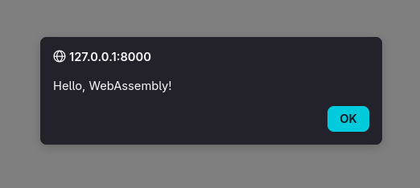

As a part of licensing for Recadia, @DecDuck brought up the idea of using signed wasm packages which allow custom licensing instructions / checks which don't require pushing a full server update. An interesting challenge on top of this though, is to identify whether we can typically package it into a single "reasonable-length" base64 string, which I would personally put at being about 512 characters (for something with this specific functionality. Otherwise 512 characters is way too many, but some concessions must be made for the cool factor).

This, plus a little more other thinking, sets the following requirements for this challenge:

A Package:

1. Must fully validate a license
2. Cannot be more than 512 base64 characters (384 bytes) typically*
3. May use basic functions provided by a host (http GET, validate signature, etc)
4. Will include a signature by the original license provider
5. Is unique per license (to require unique signatures)
6. Must be easy to implement with basic rust code
7. Returns a list of features which may be used

\* A "typical" license would be anything that does not require significant conditional feature gating such as enterprise use cases

Let's start with a basic WASM project from the [Mozilla docs](https://developer.mozilla.org/en-US/docs/WebAssembly/Guides/Rust_to_Wasm):

```shell
├── Cargo.toml
└── src
    └── lib.rs
```

```toml
[package]
name = "your-new-wasm-project"
version = "0.1.0"
edition = "2024"

[lib]
crate-type = ["cdylib"]

[dependencies]
wasm-bindgen = "0.2"
```

```rust
use wasm_bindgen::prelude::*;

#[wasm_bindgen]
extern "C" {
    pub fn alert(s: &str);
}

#[wasm_bindgen]
pub fn greet(name: &str) {
    alert(&format!("Hello, {}!", name));
}
```

You can find an explanation of what all of this does in those docs.

Running `wasm-pack build` generates a `pkg` directory, containing, among other things, our `your_new_wasm_project.wasm` file! Combining this with an `index.html` file and `python -m http.server` like so:

```
├── Cargo.lock
├── Cargo.toml
├── index.html
├── pkg
│   ├── package.json
│   ├── your_new_wasm_project_bg.js
│   ├── your_new_wasm_project_bg.wasm
│   ├── your_new_wasm_project_bg.wasm.d.ts
│   ├── your_new_wasm_project.d.ts
│   └── your_new_wasm_project.js
└── src
    └── lib.rs
```

```html
<!doctype html>
<html lang="en-US">
  <head>
    <meta charset="utf-8" />
    <title>Your new WASM project</title>
  </head>
  <body>
    <script type="module">
      import init, { greet } from "./pkg/your_new_wasm_project.js";

      init().then(() => {
        greet("WebAssembly");
      });
    </script>
  </body>
</html>
```

Gives us a lovely little introduction:



Of course, this is a far cry from what we're looking for. I mean, we're not planning on using JavaScript and a UI to run these, among quite a few other issues. Now that we know that wasm *works*, I think it's time to take a bit of a leap and already cut out the "web" part of "web assembly." Let's start with an "add" function:

```rust
#[unsafe(no_mangle)]
pub extern "C" fn add(a: i32, b: i32) -> i32 {
    a + b
}
```

Now, you might notice one or two things that are different with this. We've scrapped wasm bindgen, there's an unsafe in there, and for some reason we're using C? What's the deal with this?

See, `wasm-bindgen`, while a supremely useful tool for developing applications that need to be web native, is not actually the right tool for writing any more "raw" tools in WASM. For this use case, we need something more akin to Foreign-Function Interfaces (FFI). The relevant bit here is a bit too deep for this tutorial, but it essentially says that the functions that we define can be found in our binary by the specific name that we used, rather than being "mangled" by the compiler. The 'extern "C" ' component just ensures that it follows the C Application Binary Interface (ABI), since Rust doesn't guarantee a stable interface.

Since we're not using `wasm-bindgen` now, we will instead compile it using a wasm target like so: `cargo build --target wasm32-unknown-unknown --release`. We'll also delete the old `pkg` folder, since we're compiling into the `target/release` folder now. 

However, running this new output is a little harder. Where `wasm-bindgen` was providing an easy frontend before, we have to build our own (I promise it's not that bad). So let's add a little wrapper. In a new project (I'll call mine `runner`), I'll include `wasmtime` to act as a `wasm` runner, and create an `instance` from which we can derive the relevant functions:

```rust
use wasmtime::*;

fn main() {
    let engine = Engine::default();
    let module = Module::from_file(
        &engine,
        "../your_new_wasm_project/target/wasm32-unknown-unknown/release/your_new_wasm_project.wasm",
    )
    .unwrap();
    let mut store = Store::new(&engine, ());
    let instance = Instance::new(&mut store, &module, &[]).unwrap();

    let add = instance
        .get_typed_func::<(i32, i32), i32>(&mut store, "add")
        .unwrap();
    let res = add.call(&mut store, (-1, -2)).unwrap();

    println!("Result from Wasm: {}", res);
}
```

See? Not that bad at all. Here's what this is doing:

1. Create a wasmtime Instance from the existing `wasm` file
2. Register the "add" function as a function which takes in two i32 values (a and b), and outputs a new i32
3. Call the "add" function and print the output

```shell
cargo run
# Result from Wasm: -3
```

Success!

Alright, so we've got a library that can use wasm files to run basic functions. Let's extend it with a little bit of functionality, courtesy of the runner. For this, I'll need the following functions:

```rust
#[link(wasm_import_module = "env")]
unsafe extern "C" {
    /// Returns the current timestamp in seconds
    fn system_timestamp() -> u64;
    /// Returns a sha256 (4 byte buffer) hash of the current hardware
    fn hardware_hash() -> Buffer;
    /// Writes a POST request to a server, converting the buffer into a string
    /// Returns the status code
    fn post(url: Buffer) -> u32;
    /// Converts a buffer into a hex string
    fn hex(buf: Buffer) -> Buffer;
}
```

Here again, we are defining an extern block. If you're interested in more in-depth FFI, the [rustnomicon](https://doc.rust-lang.org/nomicon/ffi.html) has an excellent guide. You'll also notice that I have introduced a `Buffer` type. I've defined this in a crate that's shared between both the Runner and the program itself, since in the C ABI, the ordering of values in a struct does matter, so I may as well be sure that they're properly shared. All it is is a pointer and a length:

```rust
#[repr(C)]
#[derive(Clone, Copy)]
pub struct Buffer {
    pub ptr: *const u8,
    pub len: u32,
}

```

But functions are useless without being, well, used! For this, I'll make a little `validate` function. For now it'll just collect data and return that the license is valid, but we'll get around to actual checks in a moment.

```rust
use shared::Buffer;

#[link(wasm_import_module = "env")]
unsafe extern "C" {
    /// Returns the current timestamp in seconds
    fn system_timestamp() -> u64;
    /// Returns a sha256 (4 byte buffer) hash of the current hardware
    fn hardware_hash() -> Buffer;
    /// Writes a POST request to a server, converting the buffer into a string
    /// Returns the status code
    fn post(url: Buffer) -> u32;
    /// Converts a buffer into a hex string
    fn hex(buf: Buffer) -> Buffer;
}

#[unsafe(no_mangle)]
pub extern "C" fn validate(license: Buffer) -> bool {
    let hardware_hash = unsafe { hex(hardware_hash()) };
    let system_timestamp = unsafe { hex_u64(&system_timestamp()) };

    true
}

fn hex_u64<'a>(i: &'a u64) -> Buffer {
    let buf = Buffer {
        ptr: i as *const u64 as *const u8,
        len: 8,
    };
    buf
}

```

All of this is fine and well, but we also need to be able to check this against some external source. As such, we're going to need that `post` function that's still lying unused. Furthermore, we can't always assume that the license will be valid, so we'll need to check that the POST request returns a correct value. So let's start building a URL!

I'll start with a shared buffer for the URL:

```rust
static mut URL_BUF: [u8; 1024] = [0; 1024];
```

This is useful because it allows us to put all of our data into a single buffer and then send if off to the Runner via the `post` function. To edit it though, we'll need an `append` function, as well as something to keep track of where we're writing to in the URL.

```rust
static mut URL_LEN: usize = 0;

fn append(arr: &[u8]) {
    unsafe {
        let dst = (&raw mut URL_BUF as *mut u8).wrapping_add(URL_LEN);
        core::ptr::copy_nonoverlapping(arr.as_ptr(), dst, arr.len());
        URL_LEN += arr.len();
    }
}
```

Now this is a slightly frightening bit of unsafe code. Don't worry! It's really not that bad. In order, we are:

1. Getting a mutable pointer to the URL Buffer (don't do this in normal rust code!)
2. Adding an offset of the number of bytes that we've already written to this pointer (`wrapping_add`)
3. Copying data from the array to the pointer that we've generated, and writing the length of the array to it
4. Adding the number of bytes that we've written to the tracker
